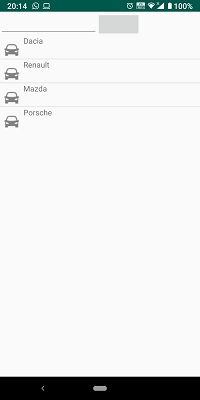
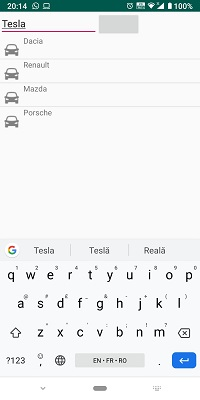
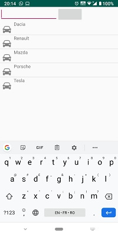

Project 1 consists of a ListView that contains some cars, with a generic image and their name. The user can add new cars by writing their name in the EditText field at the top of the page and clicking on the adjacent button; the newly introduced car will appear at the bottom of the list.

               

Project 2 (BaseAdapterExample, in root folder) displays a 3x3 GridView with some images.

Through making these 2 projects I have learned to use ListView and custom Adapters. 