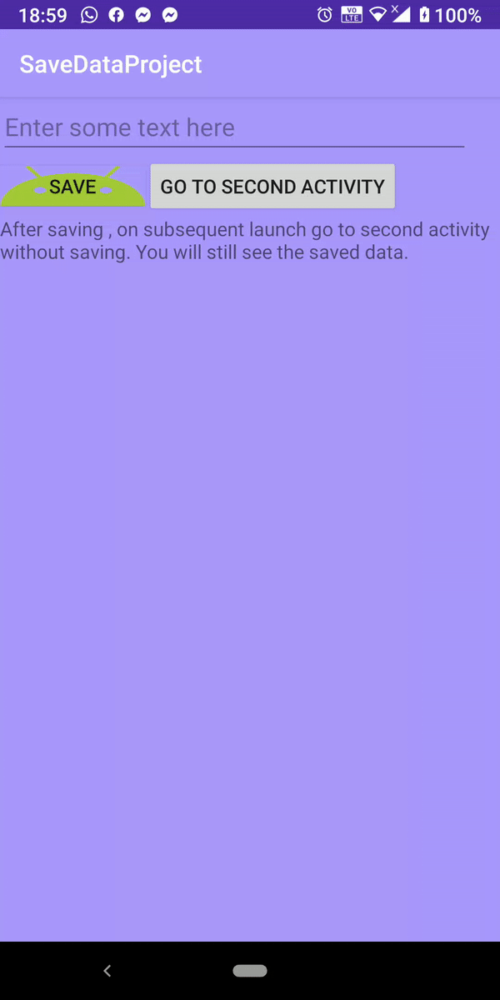

This lab shows the usage and utility of Android SharedPreferences, a method of storing data that creates a single instance of the class that all clients share. The data is stored as key-value pairs in an XML file in the app /data file.

The first screen of this app consists of an EditText field, a "SAVE" button with an image background, a "GO TO SECOND ACTIVITY" button and a TextView field, stating "After saving , on subsequent launch go to second activity without saving. You will still see the saved data". The second screen consists of two TextView fiels, the first one with changeable text and the second one with the word "true", sent as an extra in the intent that starts the second activity.

To use the app, there are the following scenarios: 
	A. 
		1. the user writes something in the EditText field
		2. the user clicks "SAVE" button
		3. the user clicks "GO TO SECOND ACTIVITY" button
		4. Outcome 1
	B. 
		1. the user writes something in the EditText field
		3. the user clicks "GO TO SECOND ACTIVITY" button
		4. Outcome 2
	C. 
		1. the user clicks "GO TO SECOND ACTIVITY" button
		2. Outcome 2

Outcome 1: the second screen displays the text the user had just introduced and the "true" word
Outcome 2: the second screen displays the last text introduced in the field **and saved** and the "true" word

The last saved text remains stored even if the app is re-run, as seen in the GIF below:

##### Encountered difficulties

I had problems changing the title bar color, because I was not aware of the "colors.xml" file.
I also had a lot of problems getting to the SharedPreferences fle, hence the delay. Unfortunately, I was not able to access it, due to my phone not being rooted.

 

