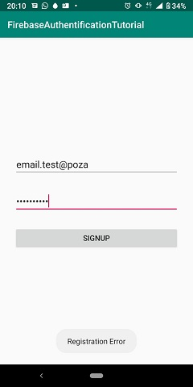
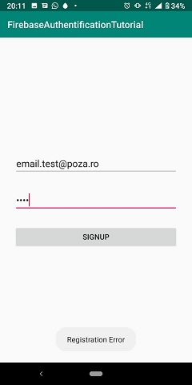
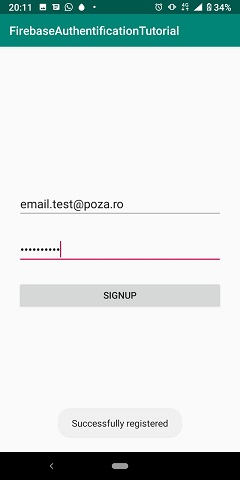

This app highlights the use of the Firebase service to sign up with email and password. The user enters an email and a password, then presses the "SIGNUP" button. If the email address has an incorrect format or the password is too short, the app will announce an error **through a Toast message**; else, the app will announce a successful signup, and the new credentials appear in the Firebase accounts database.

  

A video demo is the file "demo_video.mp4".